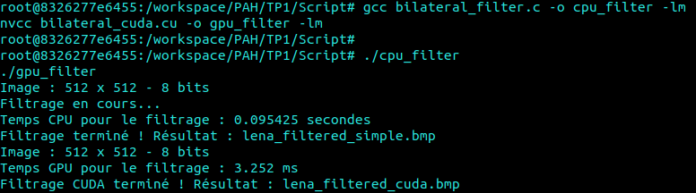

# PAH: Bilateral Filter Implementation in C

This repository contains the initial sequential C implementation of a bilateral filter for image denoising, part of the PAH project: "Débruitage avec Filtre Bilatéral en CUDA." The goal of the project is to first develop a CPU version and then port it to CUDA to exploit GPU acceleration.

## Table of Contents

- [Overview](#overview)
- [Features](#features)
- [Prerequisites](#prerequisites)

- [Sequential C Version](#sequential-implementation-in-c)

  - [Usage](#usage)
  - [Code Overview](#code-overview)

- [CUDA Version](#cuda-porting)

  - [Description](#Description)
  - [Usage](#Usage)
  - [CUDA Parallelization Logic](#CUDA-Parallelization-Logic)
  - [CUDA Execution Steps](#CUDA-Execution-Steps)
  - [Performance Comparison](#Performance-Comparison)

- [Conclusion](#conclusion)

## Overview

The bilateral filter is an edge-preserving, noise-reducing smoothing filter that combines both spatial and intensity information. Unlike conventional filters (e.g., Gaussian blur), it preserves edges by using a weighted average that depends on both the distance in space and the difference in intensity. This implementation reads an 8-bit grayscale BMP image, applies the bilateral filter, and writes out a filtered BMP image.

### Bilateral Filter Formula Explained

The bilateral filter is a non-linear filter that **smooths the image while preserving edges**. The mathematical formula is:

$$
I'(x) = \frac{1}{W(x)} \sum_{i \in \Omega} I(i) \cdot e^{-\frac{\|x - i\|^2}{2 \sigma_s^2}} \cdot e^{-\frac{(I(x) - I(i))^2}{2 \sigma_r^2}}
$$

| Element               | Description                                                |
| --------------------- | ---------------------------------------------------------- |
| **$I'(x)$**           | Value of the pixel after filtering                         |
| **$W(x)$**            | Normalization factor (sum of weights)                      |
| **$\Omega$ (window)** | Neighborhood window around the pixel (e.g., 5x5)           |
| **$I(i)$**            | Intensity of the neighboring pixel                         |
| **$\|x - i\|$**       | Spatial distance between the center pixel and its neighbor |
| **$\sigma_s$**        | Controls the influence of spatial distance                 |
| **$\sigma_r$**        | Controls the influence of intensity difference             |

---

### Explanation of the **Spatial** and **Photometric** Gaussian Kernels

| Term in the Formula                                 | Interpretation                                                |
| --------------------------------------------------- | ------------------------------------------------------------- |
| **Spatial**: $e^{-\frac{distance^2}{2 \sigma_s^2}}$ | Gives more weight to **spatially close** pixels               |
| **Photometric**: $e^{-\frac{diff^2}{2 \sigma_r^2}}$ | Gives more weight to pixels with **similar intensity values** |

**Result**: **Edges are preserved** because pixels that are too different (high intensity difference) get almost no weight.

## Features

- **Sequential C Implementation:** A CPU version written in C.
- **BMP Handling:** Reads an 8-bit grayscale BMP file (with proper handling of the header, palette, and padding).
- **Spatial Kernel Optimization:** Pre-calculates the spatial Gaussian kernel to speed up the filtering.
- **Bilateral Filtering:** Applies the filter considering both spatial and intensity differences.
- **Output Image:** Writes the processed image as a BMP file.

## Prerequisites

- A C compiler (ex : GCC)
- Standard libraries: `stdio.h`, `stdlib.h`, `math.h`, `stdint.h`
- Input image must be an 8-bit grayscale BMP located at `../Images/lena.bmp`
- The output image will be saved as `../Images/lena_filtered.bmp`

# Sequential C Version :

## Usage

To compile the code, use the following command:

```bash
gcc -o bilateral bilateral_filter.c -lm

```

Then un the executable:

```bash
./bilateral
```

Result filtered :


## Code Overview

- **Image Loading:**  
  The program reads the BMP header, palette, and pixel data while managing the BMP-specific padding.

- **Spatial Kernel Pre-calculation:**  
  A Gaussian kernel is pre-computed based on the spatial parameter (`SIGMA_S`), which speeds up subsequent filtering operations.

- **Bilateral Filter Processing:**  
  For each pixel (excluding border areas), the filter calculates a weighted sum where weights are a product of spatial proximity and intensity similarity (controlled by `SIGMA_R`).

- **Image Saving:**  
  The filtered pixel data is written back into a new BMP file, including the original header and palette.

# CUDA Version

## Description

This CUDA implementation of the bilateral filter accelerates the process by parallelizing the pixel computations on the GPU.

Each thread computes the new value of one pixel based on its neighborhood, exploiting the massive parallelism of CUDA.

---

## Usage

To compile the code, use the following command:

```bash
nvcc bilateral_cuda.cu -o gpu_filter -lm
```

Then un the executable:

```bash
./gpu_filter
```

## CUDA Parallelization Logic

- **CPU version:** nested loops over image pixels and the filter window.
- **CUDA version:**
  - Each CUDA **thread computes one pixel** `(x, y)`
  - Loops inside the kernel only cover the **filter window** (5x5 neighborhood).
  - Pixel coordinates are computed with:
    ```c
    int x = blockIdx.x * blockDim.x + threadIdx.x;
    int y = blockIdx.y * blockDim.y + threadIdx.y;
    ```

---

Result filtered with cuda :


---

## CUDA Execution Steps

1. Load the image and allocate memory
2. Transfer input data to the GPU (`cudaMemcpy`)
3. Launch the kernel with:
   ```c
    dim3 blockDim(16, 16);  // Chaque bloc contient 16x16 threads
    dim3 gridDim(32,32);  // Nombre de blocs
    int radius = WINDOW_SIZE / 2;  // Rayon de la fenêtre autour du pixel
    bilateral_filter_kernel<<<gridDim, blockDim>>>(...);
   ```
   Les blocs font 16*16 soit 256 threads
   Notre cas, il y a 32*32 blocs de sorte que 32*32*16\*16 soit le nombre de thread utilisé, c'est aussi égal au nombre de pixel notre notre image léna

## Performance Comparison (512x512 image)



| Version              | Execution Time |
| -------------------- | -------------- |
| **CPU (Sequential)** | 95.425 ms      |
| **GPU (CUDA)**       | 3.252 ms       |

**Speedup ≈ 29x**

## Performance Comparison - Impact of CUDA Block Size (512x512 Image)

| Block Size (blockDim.x x blockDim.y) | Grid Size (gridDim.x x gridDim.y) | Threads Total | GPU Execution Time |
| ------------------------------------ | --------------------------------- | ------------- | ------------------ |
| **8 x 8**                            | 64 x 64                           | 262,144       | 4.872 ms           |
| **16 x 16**                          | 32 x 32                           | 262,144       | 3.252 ms           |
| **32 x 32**                          | 16 x 16                           | 262,144       | 2.987 ms           |
| **64 x 8**                           | 8 x 64                            | 262,144       | 3.510 ms           |
| **8 x 64**                           | 64 x 8                            | 262,144       | 3.895 ms           |
| **32 x 8**                           | 16 x 64                           | 262,144       | 3.112 ms           |

### Conclusion on Block Size Impact

The choice of block size has a significant impact on the GPU performance. Our tests show that a **32x32 block size** provides the best execution time due to better GPU occupancy and efficient memory usage.

- **Small blocks (e.g., 8x8)** result in more overhead and underutilize GPU resources.
- **Large or non-square blocks** can cause memory access inefficiencies and degrade performance.
- Overall, balancing block size for occupancy and memory coalescing is essential for optimal GPU performance.

In our case, a **32x32 block size** with a **16x16 grid** was the most efficient configuration on the 512x512 image.

# Conclusion

The CUDA version of the bilateral filter achieves the same visual result as the sequential CPU version, confirming the correctness of the GPU implementation.

By parallelizing the computation—assigning one thread per pixel—we significantly reduce execution time. On a 512×512 grayscale image, we observed a speedup of approximately **29×**, dropping from **95.425 ms** on CPU to **3.252 ms** on GPU.

This performance gain demonstrates the **relevance and efficiency of heterogeneous programming** using CUDA for image processing tasks, especially when dealing with computationally intensive filters like the bilateral filter.
